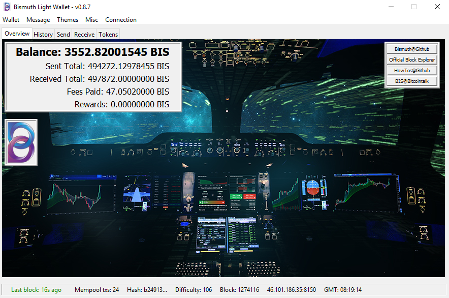

# tk-wallet
Legacy Bismuth Wallet

Code of the wallet is not very well organized. 
Most of it is sequential and very plain, although some classes and functions were added later. Testing and bug reports have made it quite stable and reliable.
If you are looking for a better experience, I strongly suggest you give the [Tornado wallet](https://github.com/bismuthfoundation/TornadoWallet) a try.

- The original wallet for Bismuth
- Supports:
    - Transactions
    - Light connectivity (no node installation required)
    - On-chain messaging
    - Themes
    - Bismuth payment URLs
    - Token issuance and transfers
    - Transaction history
    - Wallet Encryption / Decryption
    - Operations and on-chain data saving
    - Alias registration and usage
    - Custom connectivity
    - Mempool overview
    - Basic statistics
    - Document fingerprinting
    - Wallet backup, recovery, import
    - CSV export
     

See "releases" page for installers  
https://github.com/bismuthfoundation/tk-wallet/releases

# About bismuth

- https://bismuth.cz
- https://github.com/bismuthfoundation/Bismuth
